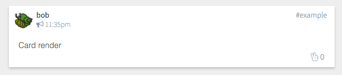
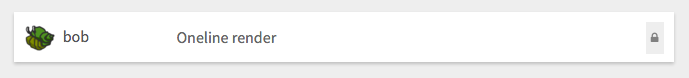
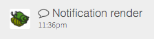

# Message Views

Render individual SSB messages. Useful alone, or in msg-list/msg-thread.





```jsx
import { Card, Oneline, Notification } from 'patchkit-msg-view'
// or:
import Card from 'patchkit-msg-view/card'
import Oneline from 'patchkit-msg-view/oneline'
import Notification from 'patchkit-msg-view/notification'

const onSelect = msg => {...}
const onToggleStar = msg => {...}
const onFlag = (msg, reason) => {...}

<Card
  msg={m}
  onToggleStar={onToggleStar}

  // optional:
  onSelect={onSelect}
  forceRaw={true|false}
  selectiveUpdate={true|false}
  onFlag={onFlag}
  forceExpanded={true|false}
  listView={true|false} />

<Oneline
  msg={m}

  // optional:
  onSelect={onSelect}
  forceRaw={true|false}
  selectiveUpdate={true|false} />

<Notification
  msg={m}
  onToggleStar={onToggleStar} />
```

Options:

 - `msg`: Required. The ssb message object
 - `onToggleStar`: Called when dig button is hit. Should publish the vote message.
 - `onFlag`: Called when a flag is published (`reason` is a string) or unpublished (`reason` is falsey). Should publish the vote message.
 - `onSelect`: Optional, called when the message is opened.
 - `forceRaw`: Render as raw data? ("Force" because usually raw is only used for unknown message types.)
 - `forceExpanded`: Automatically expand card?
 - `listView`: Render the card in listview mode?
 - `selectiveUpdate`: Use a change counter on the message to control shouldComponentUpdate? (Helps with performance.)


## Styles

Use the .less file:

```less
@import "node_modules/patchkit-msg-view/styles.less"
```

Or individual:

```less
@import "node_modules/patchkit-msg-view/card.less"
@import "node_modules/patchkit-msg-view/oneline.less"
@import "node_modules/patchkit-msg-view/notifiction.less"
```
